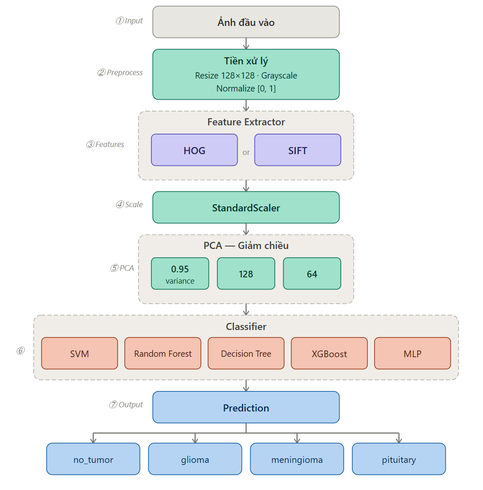
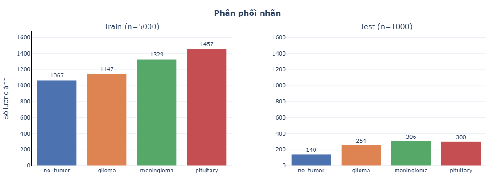
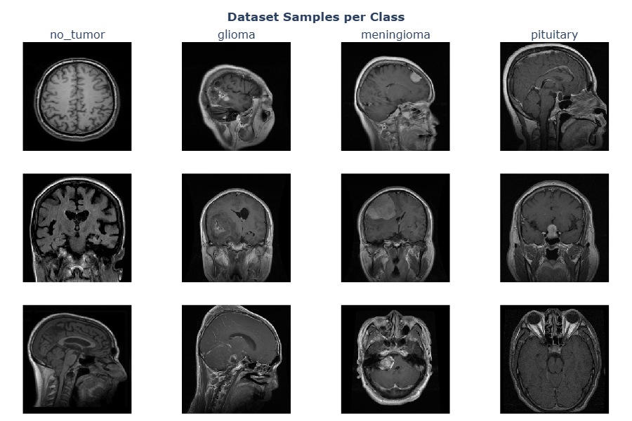
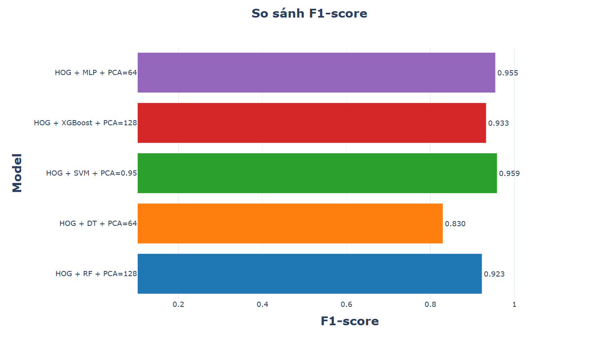
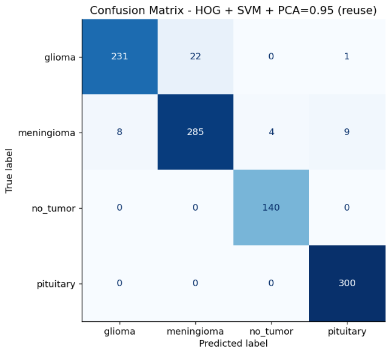
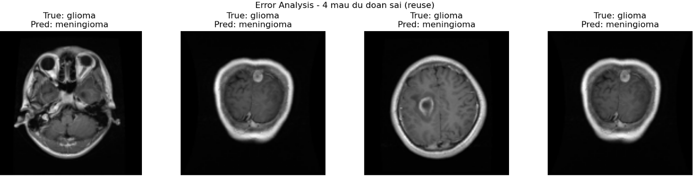

# Phân loại ảnh MRI u não bằng Machine Learning truyền thống

## 1. Tổng quan

Dự án xây dựng pipeline học máy truyền thống cho bài toán phân loại ảnh MRI não thành 4 lớp:

- `no_tumor`
- `glioma`
- `meningioma`
- `pituitary`

Mục tiêu chính:

- Xây dựng quy trình end-to-end có thể tái lập.
- So sánh HOG và SIFT (BoVW) trong bài toán MRI.
- So sánh các mô hình ML cổ điển: SVM, Random Forest, Decision Tree, XGBoost, MLP.
- Đánh giá bằng Accuracy, Precision (macro), Recall (macro), F1-score (macro), thời gian train/inference.

## 2. Phạm vi và định hướng

- Tập trung vào **machine learning truyền thống** (không dùng deep learning trong pipeline chính).
- Nhấn mạnh khả năng giải thích, tái lập và chi phí tính toán hợp lý.
- Dùng benchmark deep learning từ BRISC làm mốc tham chiếu nền.

## 3. Dữ liệu

- Dataset: **BRISC (BRain tumor Image Segmentation and Classification)**.
- Quy mô: **6000 ảnh MRI**.
- Chia tập: Train **5000**, Test **1000**.
- Mặt cắt gồm axial/coronal/sagittal.
- Mức lệch lớp nhẹ (imbalance ratio khoảng **1.37x**).
- Ảnh gần grayscale dù lưu dạng RGB (tương quan kênh rất cao).

## 4. Pipeline phương pháp

### 4.1 Tiền xử lý

- Resize ảnh về `128x128`.
- Chuyển grayscale.
- Chuẩn hóa dữ liệu đầu vào.

### 4.2 Trích xuất đặc trưng

- **HOG**: `orientations=9`, `pixels_per_cell=(8,8)`, `cells_per_block=(2,2)`, `block_norm=L2-Hys`.
- **SIFT + BoVW**: biểu diễn ảnh bằng histogram visual words.

### 4.3 Giảm chiều

- PCA theo các cấu hình: `128`, `64`, `32` hoặc giữ `95%` phương sai (`n_components=0.95`).

### 4.4 Mô hình phân loại

- SVM (RBF), Random Forest, Decision Tree, XGBoost, MLP.
- Tối ưu siêu tham số bằng GridSearchCV theo từng kịch bản.

### 4.5 Sơ đồ pipeline



## 5. EDA nổi bật

- 82.4% ảnh có kích thước `512x512`, nhưng vẫn cần resize thống nhất.
- Dữ liệu có khác biệt hình thái rõ giữa các lớp, song vẫn có mẫu khó.

### 5.1 Phân phối nhãn (Hình 3.2)



### 5.2 Ảnh mẫu dữ liệu (Hình 3.6)



## 6. Thiết kế thực nghiệm

Các nhóm thí nghiệm chính:

- 5.1: HOG + SVM vs SIFT(BoVW) + SVM
- 5.2: HOG + Random Forest + PCA
- 5.3: HOG + Decision Tree + PCA
- 5.4: HOG + SVM + PCA
- 5.5: HOG + XGBoost + PCA
- 5.6: HOG + MLP + PCA

## 7. Kết quả định lượng

### 7.1 Baseline HOG vs SIFT (Mục 5.1)

| Thiết lập | PCA | Accuracy | Precision | Recall | F1 | Train / Infer (s) |
|---|---:|---:|---:|---:|---:|---:|
| HOG + SVM | None | 0.918 | 0.921976 | 0.925080 | 0.921547 | 109.764977 / 32.615765 |
| SIFT(BoVW) + SVM | None | 0.789 | 0.801156 | 0.804111 | 0.801035 | 3.392293 / 2.300187 |

### 7.2 Kết quả các cấu hình HOG + PCA

| Thiết lập | PCA | Accuracy | Precision | Recall | F1 | Train / Infer (s) |
|---|---:|---:|---:|---:|---:|---:|
| HOG + RF | 128 | 0.917 | 0.923330 | 0.923931 | 0.922782 | 224.405285 / 0.077820 |
| HOG + RF | 64 | 0.887 | 0.894765 | 0.897114 | 0.895047 | 158.725036 / 0.077538 |
| HOG + RF | 0.95 | 0.887 | 0.898296 | 0.895644 | 0.895505 | 883.068758 / 0.091827 |
| HOG + DT | 128 | 0.824 | 0.825308 | 0.834630 | 0.829559 | 20.404360 / 0.001060 |
| HOG + DT | 64 | 0.827 | 0.826486 | 0.834654 | 0.830082 | 10.523545 / 0.001169 |
| HOG + DT | 0.95 | 0.803 | 0.809197 | 0.816386 | 0.812436 | 262.507357 / 0.001841 |
| HOG + SVM | 128 | 0.906 | 0.903720 | 0.914658 | 0.906934 | 12.852651 / 0.279147 |
| HOG + SVM | 64 | 0.885 | 0.881605 | 0.897952 | 0.886720 | 9.172444 / 0.193243 |
| **HOG + SVM** | **0.95** | **0.956** | **0.958708** | **0.960205** | **0.959124** | 287.277244 / 5.913671 |
| HOG + XGBoost | 128 | 0.927 | 0.932325 | 0.933622 | 0.932755 | 576.296931 / 0.024516 |
| HOG + XGBoost | 64 | 0.925 | 0.929819 | 0.931654 | 0.930445 | 281.800049 / 0.018638 |
| HOG + XGBoost | 32 | 0.922 | 0.929279 | 0.927063 | 0.927443 | 146.244813 / 0.024668 |
| HOG + MLP | 128 | 0.932 | 0.932675 | 0.938776 | 0.935247 | 5.654602 / 0.009295 |
| **HOG + MLP** | **64** | **0.953** | **0.954933** | **0.955968** | **0.955251** | **7.148280 / 0.008437** |
| HOG + MLP | 0.95 | 0.909 | 0.915623 | 0.918445 | 0.915724 | 17.050505 / 0.032972 |

Kết luận chính:

- Cấu hình tốt nhất toàn cục: **HOG + SVM + PCA=0.95**.
- Cấu hình cân bằng tốt giữa chất lượng và tốc độ: **HOG + MLP + PCA=64**.
- HOG phù hợp hơn SIFT trong bối cảnh dữ liệu MRI của bài toán này.

### 7.3 Biểu đồ so sánh F1-score



## 8. Phân tích lỗi

- Cặp lớp dễ nhầm nhất: **glioma** và **meningioma**.
- `no_tumor` và `pituitary` tách tốt hơn.

| Confusion Matrix | Error Samples |
|---|---|
|  |  |

## 9. Cấu trúc thư mục

```text
Machine_Learning_252/
|-- classification_task/
|   |-- train/
|   `-- test/
|-- docs/
|   |-- report.pdf
|   `-- slide.pdf
|-- report/
|   |-- main.tex
|   |-- Sections/
|   `-- Images/
|-- Machine_learning_252.ipynb
`-- pipeline.py
```

## 10. Hướng dẫn chạy

### 10.1 Cài môi trường

```bash
python -m venv venv
venv\Scripts\activate
pip install numpy matplotlib pillow scikit-image scikit-learn xgboost opencv-contrib-python jupyter
```

### 10.2 Chạy notebook

```bash
jupyter notebook Machine_learning_252.ipynb
```

### 10.3 Chạy nhanh bằng `pipeline.py` (ví dụ)

```python
from pipeline import LoadData, HOGFeatureExtractor, SVMModel, PipeLine

data = LoadData(
    path="classification_task",
    image_size=(128, 128),
    color_mode="grayscale",
    normalize=True,
)

extractor = HOGFeatureExtractor(
    orientations=9,
    pixels_per_cell=(8, 8),
    cells_per_block=(2, 2),
    block_norm="L2-Hys",
)

model = SVMModel(
    param_grid={
        "C": [0.1, 1.0, 10],
        "kernel": ["rbf"],
        "gamma": ["scale"],
    },
    cv=5,
    scoring="f1_macro",
)

pipeline = PipeLine(
    data_load=data,
    feature_extractor=extractor,
    model=model,
    n_components=0.95,
)

metrics = pipeline.run()
print(metrics)
```

## 11. Kết luận và hướng phát triển

- Đã xây dựng thành công pipeline ML truyền thống cho phân loại MRI u não.
- Hiệu quả nhất: **HOG + SVM + PCA=0.95**.
- Hướng phát triển: mở rộng tuning siêu tham số, so sánh thêm với baseline deep learning, và đóng gói pipeline phục vụ thử nghiệm triển khai thực tế.

## 12. Tài liệu tham khảo

- BRISC dataset: https://www.kaggle.com/datasets/briscdataset/brisc2025
- Scikit-learn: https://scikit-learn.org/stable/
- scikit-image HOG: https://scikit-image.org/docs/stable/api/skimage.feature.html#skimage.feature.hog
- XGBoost docs: https://xgboost.readthedocs.io/
- Hussain et al., *Scientific Data* (2023): https://doi.org/10.1038/s41597-023-02497-2

## 13. Nhóm thực hiện

- Nguyễn Trần Anh Quân - 2312845
- Bùi Ngọc Phúc - 2312665
- Lê Trần Tấn Phát - 2312580
- Nghiêm Nguyễn Trường An - 2310013
